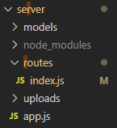

## Get ready
이전 포스트를 학습하고 본 포스트를 읽기를 추천합니다.
- 이전 포스트 링크: [Nodejs 간단 튜토리얼(1)](https://gyuree-kim.github.io/nodejs/nodejs-tutorial/)

## 기술스택
본 포스트에서는 nodejs를 백엔드 개발을 위해 사용하며, `express`, `mongodb`, `mongoose`를 사용합니다. 각각의 개념과 차이점은 여기서 다루지 않겠습니다. 설치 명령어는 다음과 같습니다.
```
npm install express mongodb mongoose
```

## 프로젝트 시작하기
설치가 완료되면 프로젝트를 시작합시다. 일단, `nodejs`가 동작하도록 합시다. 본 포스트에서는 가장 간단하지만 웬만한 프로젝트 구성에 어려움이 없도록 효율적으로 학습하고자 합니다.

### 프로젝트 구조

#### 각 디렉토리 설명
- `server`: <br>
프로젝트 이름을 넣거나, 프론트엔드와 백엔드를 하나의 레포에서 관리할 경우 이미지와 같이 `server` 또는 `backend` 등의 이름으로 입력합니다.
- `models`: <br>
`mysql`을 학습한 경험이 있다면, mysql의 `table`과 비슷한 개념이라고 볼 수 있습니다. `mongodb`는 `nosql`이기 때문에 document에 어떤 값을 넣어도 에러가 발생하지 않아 잘못된 값이나 타입이 저장되는 경우도 빈번합니다. 이를 방지하고자 `mongoose`는 `schema`를 도입하여 마치 sql처럼 db 저장 이전에 필드를 검사하여 에러를 발생시킵니다.
- `routes`: <br>
`api`를 작성하기 위해 필요한 폴더입니다. api 개수가 많아질 경우 파일을 분리하여 관리할 수 있는데, 이는 다음 포스팅에서 작성하겠습니다.
- `uploads`: <br>
`resources` 또는 `public`이라 이름해도 괜찮습니다. 이미지, css, js 같은 파일을 저장하는 디렉토리입니다.
- `app.js`: <br>
가장 중요한 파일입니다. 서버를 구동할 때 이 파일을 이용하여 시작하게 될 것입니다. 일반 프로그램의 `main`의 역할과 비슷합니다.

## app.js
#### import packages
```js
const express = require('express')
const mongoose = require('mongoose');
const router = require('./routes');
```
#### Express 프레임워크 시작
```js
const app = express();
```

#### 포트 설정
포트 번호는 마음대로 변경 가능
```js
const port = process.env.PORT || 3000;
```

#### API를 route
```js
app.use('/api', router);
```

#### DB 연결(1)
`url`은 반드시 `27017` 포트로 연결되어야합니다.
```js
const url = "mongodb://localhost:27017"
const db = mongoose.connection;
db.on('error', console.error);
db.once('open', function(){
    console.log("Connected to mongod server");
});
```

#### DB 연결(2), 서버 시작
```js
mongoose.connect(url, function(err){
    if(err) {
        console.log('Unable to connect to the mongoDB server.error', err);
    }
    else {
        // 서버 시작
        app.listen(port, ()=>{
        console.log(`Listening on port ${port}, go to localhost:3000/`)
})
    }
});
```

#### full code
```js
const express = require('express')
const mongoose = require('mongoose');
const router = require('./routes');

const app = express();
const port = process.env.PORT || 3000;
app.use('/api', router);

const url = "mongodb://localhost:27017"
const db = mongoose.connection;
db.on('error', console.error);
db.once('open', function(){
    console.log("Connected to mongod server");
});

mongoose.connect(url, function(err){
    if(err) {
        console.log('Unable to connect to the mongoDB server.error', err);
    }
    else {
        app.listen(port, ()=>{
        console.log(`Listening on port ${port}, go to localhost:${port}}/`)
})
    }
});
```
이제 `node server.js`를 터미널에 입력해봅시다. `Listening on port 3000, go to localhost:3000`이 출력된다면 서버 연결에 성공한 것!

## routes/index.js
#### import packages
```js
var mongodb = require('mongodb');
var express = require('express');
var router = express.Router();
```

#### get api
```js
router.get('/', function(req, res) {
    res.send('Hello world!');
});

```

#### export module
```js
module.exports = router;
```

#### full code
```js
#### import packages
var mongodb = require('mongodb');
var express = require('express');
var router = express.Router();

router.get('/', function(req, res) {
    res.send('Hello world!');
});

module.exports = router;
```

`^C`를 통해 서버를 종료하고 다시 `node app.js`를 입력하여 서버를 시작한 후, `localhost:3000`으로 접속합시다. 포트를 변경했다면 변경한 포트 번호를 입력합니다. url로 접속하면, 서버에서 클라이언트로 전송한 `Hello world!`가 출력되는 것을 확인할 수 있습니다. :)

<br><br>

### 다음 포스트 링크:
[Nodejs 간단 튜토리얼(3) - model schema 작성](https://gyuree-kim.github.io/nodejs/nodejs-tutorial3/)